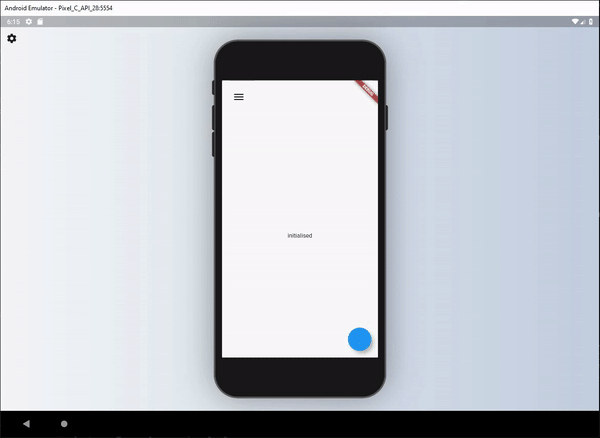

[](https://youtu.be/neRnM_SiTfA)

# Responsive Builder 💻➡️🖥➡️📱➡️⌚️

The responsive builder package contains widgets that allows you to create a readable responsive UI. The package is inspired by the [Responsive UI Flutter series](https://www.youtube.com/playlist?list=PLQQBiNtFxeyJbOkeKBe_JG36gm1V2629H) created by FilledStacks.

It aims to provide you with widgets that make it easy to build different UI's along two different Axis. Orientation x ScreenType. This means you can have a separate layout for Mobile - Landscape, Mobile - Portrait, Tablet - Landscape and Tablet-Portrait.

If you follow along with the series you will have a complete understanding of how it's built and how to use it. [Part 2](https://youtu.be/udsysUj-X4w) goes over how we build the example included in this project.



## Installation

Add responsive_builder as dependency to your pubspec file.

```
responsive_builder:
```

## Usage

This package provides a widget called `ResponsiveBuilder` that provides you with a builder function that returns the current `SizingInformation`. The `SizingInformation` includes the `DeviceScreenType`, `screenSize` and `localWidgetSize`. This can be used for fine grained responsive control from a view level down to per widget responsive level.

### Responsive Builder

The `ResponsiveBuilder` is used as any other builder widget.

```dart
// import the package
import 'package:responsive_builder/responsive_builder.dart';

// Use the widget
ResponsiveBuilder(
    builder: (context, sizingInformation) {
      // Check the sizing information here and return your UI
          if (sizingInformation.deviceScreenType == DeviceScreenType.desktop) {
          return Container(color:Colors.blue);
        }

        if (sizingInformation.deviceScreenType == DeviceScreenType.tablet) {
          return Container(color:Colors.red);
        }

        if (sizingInformation.deviceScreenType == DeviceScreenType.watch) {
          return Container(color:Colors.yellow);
        }

        return Container(color:Colors.purple);
      },
    },
  );
}
```

This will return different colour containers depending on which device it's being shown on. A simple way to test this is to either run your code on Flutter web and resize the window or add the [device_preview](https://pub.dev/packages/device_preview) package and view on different devices.

## Orientation Layout Builder

This widget can be seen as a duplicate of the `OrientationBuilder` that comes with Flutter, but the point of this library is to help you produce a readable responsive UI code base. As mentioned in the [follow along tutorial](https://youtu.be/udsysUj-X4w) I didn't want responsive code riddled with conditionals around orientation, `MediaQuery` or Renderbox sizes. That's why I created this builder.

The usage is easy. Provide a builder function that returns a UI for each of the orientations.

```dart
// import the package
import 'package:responsive_builder/responsive_builder.dart';

// Return a widget function per orientation
OrientationLayoutBuilder(
  portrait: (context) => Container(color: Colors.green),
  landscape: (context) => Container(color: Colors.pink),
),
```

This will return a different coloured container when you swap orientations for your device. In a more readable manner than checking the orientation with a conditional.

Sometimes you want your app to stay in a certain orientation. use `mode` property in `OrientationLayoutBuilder` to enforce this.

```dart
OrientationLayoutBuilder(
  /// default mode is 'auto'
  mode: info.isMobile
    ? OrientationLayoutBuilderMode.portrait
    : OrientationLayoutBuilderMode.auto,
  ...
),
```

## Screen Type Layout

This widget is similar to the Orientation Layout Builder in that it takes in Widgets that are named and displayed for different screen types.

```dart
// import the package
import 'package:responsive_builder/responsive_builder.dart';

// Construct and pass in a widget per screen type
ScreenTypeLayout(
  mobile: Container(color:Colors.blue)
  tablet: Container(color: Colors.yellow),
  desktop: Container(color: Colors.red),
  watch: Container(color: Colors.purple),
);
```

If you don't want to build all the widgets at once, you can use the widget builder. A widget for the right type of screen will be created only when needed.

```dart
// Construct and pass in a widget builder per screen type
ScreenTypeLayout.builder(
  mobile: (BuildContext context) => Container(color:Colors.blue),
  tablet: (BuildContext context) => Container(color:Colors.yellow),
  desktop: (BuildContext context) => Container(color:Colors.red),
  watch: (BuildContext context) => Container(color:Colors.purple),
);
```

## Custom Screen Breakpoints

If you wish to define your own custom break points you can do so by supplying either the `ScreenTypeLayout` or `ResponsiveBuilder` widgets with a `breakpoints` argument.

```dart
// import the package
import 'package:responsive_builder/responsive_builder.dart';

//ScreenTypeLayout with custom breakpoints supplied
ScreenTypeLayout(
  breakpoints: ScreenBreakpoints(
    tablet: 600,
    desktop: 950,
    watch: 300
  ),
  mobile: Container(color:Colors.blue)
  tablet: Container(color: Colors.yellow),
  desktop: Container(color: Colors.red),
  watch: Container(color: Colors.purple),
);
```

To get a more in depth run through of this package I would highly recommend [watching this tutorial](https://youtu.be/udsysUj-X4w) where I show you how it was built and how to use it.

## Global Screen Breakpoints

If you want to set the breakpoints for the responsive builders once you can call the line below before the app starts, or wherever you see fit.

```dart
void main() {
  ResponsiveSizingConfig.instance.setCustomBreakpoints(
    ScreenBreakpoints(desktop: 800, tablet: 550, watch: 200),
  );
  runApp(MyApp());
}
```

This will then reflect the screen types based on what you have set here. You can then still pass in custom break points per `ScreenTypeLayout` if you wish that will override these values for that specific `ScreenTypeLayout` builder.

## Screen Type specific values

Sometimes you don't want to write an entire new UI just to change one value. Say for instance you want your padding on mobile to be 10, on the tablet 30 and desktop 60. Instead of re-writing UI you can use the `getValueForScreenType` function. This is a generic function that will return your value based on the screen type you're on. Take this example below.

```dart
Container(
  padding: EdgeInsets.all(10),
  child: Text('Best Responsive Package'),
)
```

What if you ONLY want to update the padding based on the device screen size. You could do.

```dart
var deviceType = getDeviceType(MediaQuery.sizeOf(context));
var paddingValue = 0;
switch(deviceType) {
  case DeviceScreenType.desktop:
    paddingValue = 60;
    break;
  case DeviceScreenType.tablet:
    paddingValue = 30;
    break;
  case DeviceScreenType.mobile:
    paddingValue = 10;
    break;
}
Container(
  padding: EdgeInsets.all(paddingValue),
  child: Text('Best Responsive Package'),
)
```

Ooooorrrr, you can use shorthand for that.

```dart
Container(
  padding: EdgeInsets.all(getValueForScreenType<double>(
                context: context,
                mobile: 10,
                tablet: 30,
                desktop: 60,
              )),
  child: Text('Best Responsive Package'),
)
```

It will return the value you give it for the DeviceScreen you're viewing the app on. For instance you want to hide a widget on mobile and not on tablet?

```dart
getValueForScreenType<bool>(
    context: context,
    mobile: false,
    tablet: true,
  ) ? MyWidget() : Container()
```

That will return true on tablet devices and false on mobile.

## Responsive Sizing

In addition to providing specific layouts per device type there's also the requirement to size items based on the screen width or height. To use this functionality we added some responsive extensions. To use this wrap your Material or Cupertino App with the `ResponsiveApp` widget. 

```dart
ResponsiveApp(
  builder: (context) => MaterialApp(
    ...
  )
)
```

This is required to use the following functionality. 

### Responsive Sizing

To use the responsive sizing all you need to do is the following. 

```dart
import 'package:responsive_builder/responsive_builder.dart';

SizedBox(height: 30.screenHeight); // Or sh for shorthand
Text('respond to width', style: TextStyle(fontSize: 10.sw));
```

Use the number you want as the percentage and call the `screenHeight` or `screenWidth` extension. These also have shorthand extensions `sh` and `sw`.

## Contribution

1. Fork it!
2. Create your feature branch: `git checkout -b my-new-feature`
3. Commit your changes: `git commit -am 'Add some feature'`
4. Push to the branch: `git push origin my-new-feature`
5. Submit a pull request.
